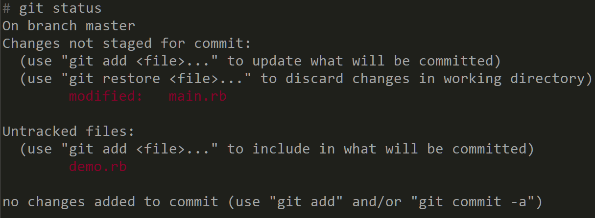
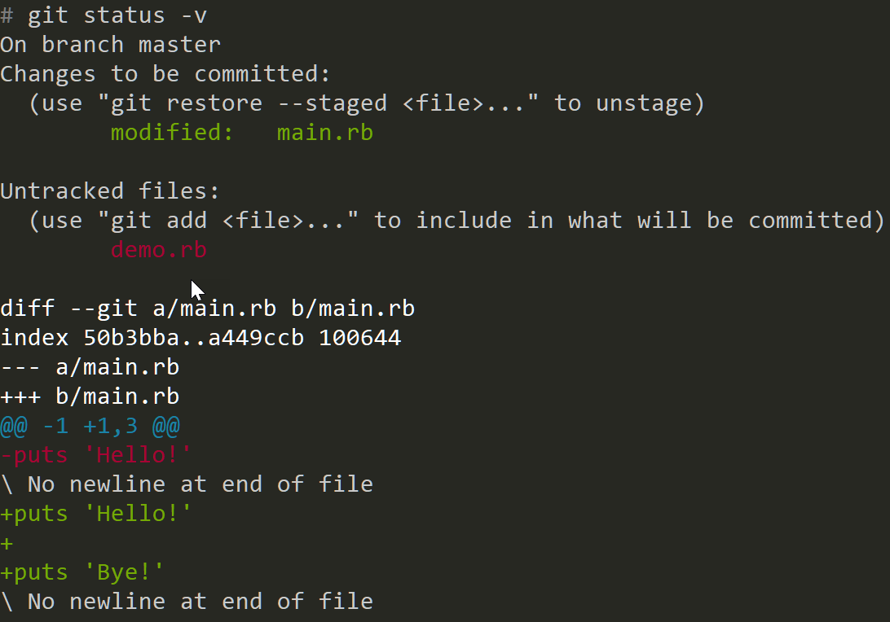
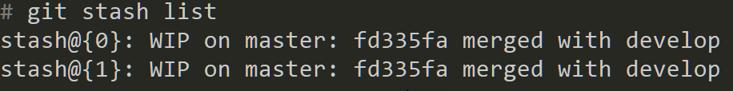
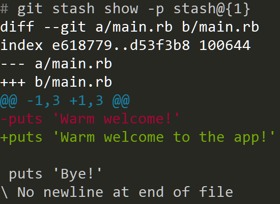
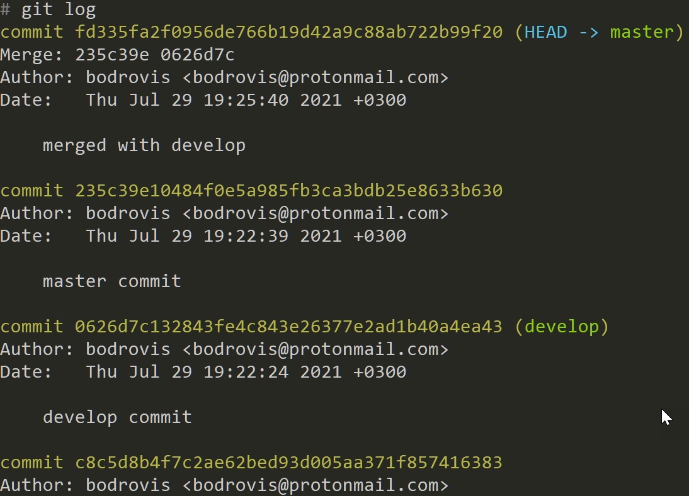
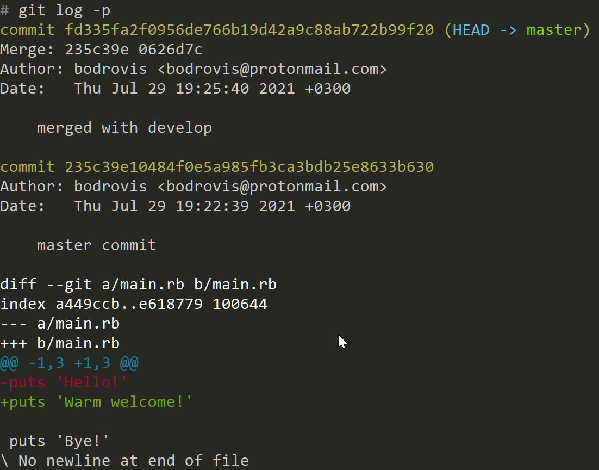
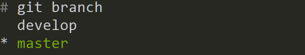
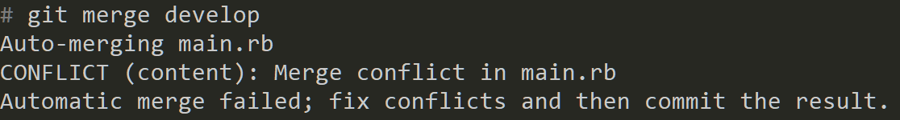
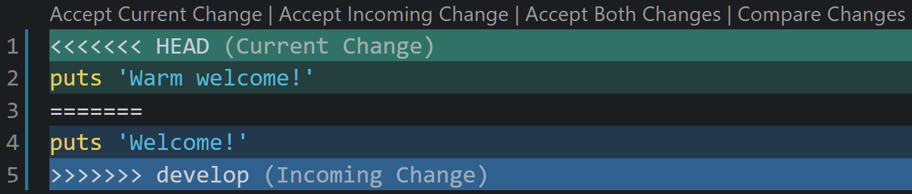

# 10 команд Git для вашей повседневной работы

Git - это система контроля версий, которая стала стандартом де-факто для многих разработчиков. В принципе, любой программист сегодня обязан знать основы Git и понимать, как работать с этой системой. Поэтому в этой статье мы обсудим наиболее распространенные и полезные команды Git, которые вы, скорее всего, будете использовать в своей повседневной работе. Мы рассмотрим несколько примеров и поговорим об использовании этих команд, так что держитесь крепче, и давайте начнем!

- Пререквизиты (Prerequisites)
- git init
    - Некоторая терминология
    - Состояния файлов
- git status
- git add
- git commit
- git push/pull
- git stash
- git log
- git branch
- git checkout
- git merge
- Заключение


## Prerequisites

Чтобы следовать этой статье, вам потребуется установить Git на вашем компьютере (очевидно, не так ли?). Я собираюсь использовать Git 2.32.0, которая является последней версией на момент написания этой статьи.

Кроме этого, никаких особых требований нет: вы можете использовать любую операционную систему и любой инструмент командной строки.

## git init

init - это команда Git, которая инициализирует или повторно инициализирует Git-репозиторий в текущей папке. Итак, после того как вы создали папку для своего нового блестящего проекта, просто зайдите в эту папку и выполните команду:

```sh
git init
```

По сути, эта команда создает скрытую папку `.git` со всеми Git-удобствами, необходимыми для правильного контроля версий. Эта папка очень важна, так как в ней будет храниться вся история вашего проекта, поэтому не удаляйте ее, если вы не понимаете, что делаете.

По умолчанию `git init` создает единственную "основную" ветвь в вашем проекте. В зависимости от ваших настроек, эта ветвь может называться **master** или **main**. Чтобы изменить имя первичной ветви, укажите флаг `-b`:

```sh
git init -b primary
```

## Некоторая терминология

Прежде чем продолжить, давайте рассмотрим некоторые общие термины.

* Прежде всего, важно понимать, что изменения, которые мы выполняем, производятся в так называемом рабочем дереве проекта. По сути, рабочее дерево - это коллекция ваших файлов и папок (за исключением файлов внутри папки `.git`) в том состоянии, в котором они существуют в файловой системе. Вы можете свободно создавать, изменять и удалять файлы и папки в рабочем дереве, как обычно. Рабочее дерево наблюдает за всеми вашими изменениями и делает заметки о них.

* Индекс (или <u>"зона ожидания"</u>) - это как снимок вашего рабочего дерева, содержащий все текущие изменения. Проще говоря, это большой файл внутри папки `.git`, который содержит все ваши файлы и их контрольные суммы.

* Когда мы выполняем __commit__, созданный снимок добавляется в историю проекта. Вы можете просматривать созданные коммиты и даже восстанавливать предыдущие версии файла

* **Branch**(Ветвь) - это как независимая версия одного и того же проекта, хранящаяся в одной и той же папке. Вы можете переключаться между этими независимыми версиями, вносить изменения по мере необходимости и в какой-то момент объединить две версии вместе (или полностью удалить одну из них). Как говорится в книге по Git'у, " Ветвление означает, что вы отклоняетесь от основной линии разработки и продолжаете работу, не нарушая эту основную линию".

## Состояния файла(File states)

Каждый файл в рабочем дереве может иметь <u>следующие состояния</u>:

* Untracked - новый файл был добавлен в рабочее дерево, но он еще не отслеживается Git'ом. Вы можете начать отслеживать его с помощью команды `git add` (см. ниже).

* Modified (Измененные) - изменения были внесены в рабочее дерево, но еще не поставлены на фиксацию (другими словами, эти изменения не добавлены в текущий индекс).

* Staged - изменения были добавлены в индекс. Таким образом, они станут частью следующего коммита.

* Commited (Зафиксировано) - изменения были добавлены в историю проекта как часть коммита. Все коммиты хранятся в папке `.git`.

Наконец, вот хорошее объяснение из книги Git, в которой рассказывается о моментальных снимках:

>Git не думает и не хранит свои данные таким образом. Вместо этого Git думает о своих данных как о серии снимков миниатюрной файловой системы. В Git'е каждый раз, когда вы фиксируете или сохраняете состояние вашего проекта, Git делает снимок того, как выглядят все ваши файлы в этот момент, и сохраняет ссылку на этот снимок. Чтобы быть эффективным, если файлы не изменились, Git не хранит файл снова, а только ссылку на предыдущий идентичный файл, который он уже хранил. Git думает о своих данных скорее как о потоке снимков.

Теперь, когда мы знаем некоторую терминологию, давайте обсудим другие полезные команды Git!

## git status

<u>status</u> показывает, в общем, статус вашего рабочего дерева. В частности, вы сможете увидеть текущую ветвь, отслеживаемые и неотслеживаемые файлы, а также поэтапные и непоэтапные изменения:



Итак, в приведенном выше примере мы видим, что текущая ветка - `master`. Файл `main.rb` уже отслеживается Git'ом, и в нем есть некоторые изменения, которые еще не поставлены на фиксацию (как этого добиться, мы увидим чуть позже).

Также мы видим, что `demo.rb` еще не отслеживается Git'ом.

Вот некоторые общие опции для команды `git status`:

- `-s` - вывод на экран в коротком формате.
- `-b` - показывать информацию о ветви и отслеживании в кратком формате.
- `-v` - показать текстовые изменения, которые находятся на стадии фиксации. Вот пример подробного вывода:



Здесь вы можете увидеть не только имена файлов, но и то, что именно изменилось в этих файлах (новые изменения имеют зеленый цвет текста).

## git add
[`add`](https://git-scm.com/docs/git-add) - это, пожалуй, одна из самых распространенных команд Git. Итак, какую операцию она выполняет? По сути, она обновляет индекс содержимым, найденным в вашем рабочем дереве, тем самым делая содержимое подготовленным для следующего коммита. Индекс - это как снимок вашего рабочего дерева. Когда вы выполняете фиксацию, этот снимок используется. Поэтому перед выполнением фиксации вы должны выполнить `git add` для всех изменённых или созданных файлов.

В самом простом случае вы можете сказать:

```sh
git add .
```
Эта точка `.` означает "взять все файлы в рабочем дереве" и добавить их в индекс.

Однако вы также можете добавлять отдельные файлы и папки, а также использовать сгустки файлов:

```sh
git add single_file.txt
git add my_folder
git add *.rb
```
Итак, подведем итог: после того, как вы внесли некоторые изменения в свой проект, вам нужно будет выполнить команду `git add` перед фиксацией.

Эта команда принимает множество различных опций, которые вы можете найти в официальной [документации](https://git-scm.com/docs/git-add).

## git commit
[`commit`](https://git-scm.com/docs/git-commit) - одна из самых важных команд Git, поскольку она записывает изменения в репозитории на основе текущего индекса (созданного вами снимка).

Чтобы выполнить новую фиксацию и добавить к ней небольшое информационное сообщение, выполните:

```sh
git commit -m "My first commit"
```
Теперь все поставленные файлы будут зафиксированы и добавлены в историю проекта.

Также вы можете использовать опцию `-a` для автоматической постановки и последующей фиксации всех измененных и удаленных файлов:
```sh
git commit -am "My first commit"
```
К сожалению, эта опция будет игнорировать неотслеживаемые файлы, поэтому вам все равно придется сказать `git add .` для этих новых файлов.

## git push/pull

[`push`](https://git-scm.com/docs/git-push) - команда Git позволяет отправлять локальные изменения в удаленный репозиторий, который обычно размещается на таких сервисах, как GitHub, Bitbucket, GitLab или Azure DevOps repos.

Прежде всего, вам нужно добавить информацию об этом удаленном репозитории, выполнив что-то вроде:
```sh
git remote add origin https://github.com/username/repo.git
```
Обычно эта команда предоставляется вам службой, которую вы используете. Что она делает? Она создает что-то вроде "указателя" на удаленный репозиторий, который хранится на `github.com`. У этого удаленного хранилища есть псевдоним `origin`, но вы можете называть его как угодно (например, просто `github`).

Теперь, когда удаленный репозиторий предоставлен, вы можете продвигать свои локальные изменения:
```sh
git push origin master
```
В этом примере мы берем содержимое ветки `master` и отправляем его в удаленный репозиторий, который имеет псевдоним `origin`.

Вы также можете установить `origin` как "upstream", сказав:
```sh
git push -u origin master
```
Теперь вам больше не нужно указывать `origin`. Просто скажите:
```sh
git push
```
Однако обратите внимание, что это будет работать только для ветки master, которая была указана при создании upstream - для всех остальных веток вам все равно придется сказать:
```sh
git push origin another_branch
```
Чтобы получить изменения из удаленного хранилища и применить их локально, используйте:

```sh
git pull origin master
```
Эта команда работает так же, как git push. Если вы указали upstream, вы можете просто сказать:

```sh
git pull
```
Обратите внимание, что могут возникнуть конфликты слияния, и вам придется разрешать их вручную (о конфликтах читайте в следующем разделе о команде `git merge`).

## git stash

Команда [`stash`](https://git-scm.com/docs/git-stash) сохраняет все ваши модификации с момента последнего коммита, складирует их и возвращается в чистый рабочий каталог. Другими словами, если вы выполнили некоторые изменения с момента последнего коммита, но затем решили, что эти изменения больше не актуальны, вы можете выполнить:

```sh
git stash
```
Теперь все внесенные вами изменения будут храниться отдельно, а состояние проекта будет возвращено к последнему коммиту. Вы можете создать столько тайников, сколько нужно, а чтобы просмотреть их, выполните следующие действия:

```sh
git stash list
```
Вот результат:



В этом примере было создано два stashes (`stash@{1}` был создан раньше `stash@{0}`, другими словами, первая запись является последней).

Вы также можете просмотреть содержимое каждого тайника:

```sh
git stash show -p stash@{1}
```



Таким образом, вы можете увидеть, что именно было изменено в этом stash.

Если вы решите извлечь изменения из stash и снова применить их к текущей версии проекта, выполните:

```sh
git stash apply stash@{1}
```
Теперь изменения снова станут видимыми в текущей версии проекта.

## git log

[`log`](https://git-scm.com/docs/git-log) команда Git отображает журналы фиксации и позволяет увидеть, какие изменения были сделаны, когда и кем:

```sh
git log
```



Для каждой фиксации вы можете увидеть:

- Его контрольную сумму (длинная буквенно-цифровая строка)
- Автор
- Дата
- Сообщение о фиксации
- `HEAD -> master` означает, что фиксация была выполнена на ветке `master`, и это текущая версия, которую мы просматриваем в данный момент.
- `develop` означает, что фиксация была выполнена на ветке `develop`.

Для просмотра более подробной информации используйте флаг `-p`:



В этом случае вы можете увидеть, что именно было изменено в каждом коммите (первый коммит ничего не показывает, потому что мы выполнили merge(слияние)).

Кроме того, вы можете указать номер следующим образом:

```sh
git log -p -2
```

В данном случае 2 означает "показать только два последних коммита".

## git branch

[`branch`](https://git-scm.com/docs/git-branch) - это команда Git, которая позволяет управлять ветвями проекта. Ветка - это, по сути, отдельная версия вашего проекта, и [возможность работать с разными ветвями](https://git-scm.com/about) - одна из самых мощных возможностей Git. Как уже упоминалось выше, изначально у вас будет только одна "основная" ветвь, но можно создать столько ветвей, сколько необходимо. Обычно разработчики создают отдельные ветки при внедрении новых функций или исправлении ошибок - это очень удобно, поскольку таким образом они не портят основную версию приложения.

Чтобы просмотреть все ответвления в проекте, выполните команду:

```sh
git branch
```

Вот результат:



Мы видим, что проект имеет две ветви:

- `master` - это выбранная в данный момент ветвь.
- `develop` - мы можем переключаться на эту ветвь по мере необходимости.

Чтобы создать новую ветвь, выполните:

```sh
git branch YOUR_BRANCH_NAME
```

Новая ветвь будет создана на основе текущей версии вашего рабочего дерева. Если вы хотите создать ветвь на основе какой-то другой версии, вам нужно будет указать имя существующей ветви и новое имя:

```sh
git branch NEW_BRANCH_NAME EXISTING_BRANCH_NAME
```

В этом случае новая ветвь будет создана на основе существующей ветви, которую вы указали.

Чтобы переименовать локальную ветвь, выполните:

```sh
git branch -m OLD_NAME NEW_NAME
```

Кроме того, вы можете переименовать текущую ветвь, выполнив команду:

```sh
git branch -m NEW_NAME
```

Чтобы удалить локальную ветвь, выполните команду:

```sh
git branch -d BRANCH_NAME
```

Обратите внимание, что для удаления удаленной ветки вам придется быть немного более многословным:

```sh
git push origin --delete REMOTE_BRANCH_NAME
```

## git checkout

Команда [`checkout`](https://git-scm.com/docs/git-checkout) Git позволяет переключаться между ветками.

В простейшем случае вы можете сказать:

```sh
git checkout BRANCH_NAME
```

Вы переключитесь на другую ветвь, и соответствующая версия проекта будет загружена для вас автоматически.

Также вы можете создать новую ветку на основе текущей и переключиться на нее одной командой:

```sh
git checkout -b NEW_BRANCH_NAME
```

В этом случае вы создадите новую ветвь на основе текущей выбранной и также переключитесь на нее. Удобно, да?

Кроме того, `checkout` имеет расширенные возможности использования, позволяющие путешествовать в прошлое и даже восстанавливать старые версии файлов.


## git merge

Команда [`merge`](https://git-scm.com/docs/git-merge) Git объединяет истории разработки вместе. Другими словами, она позволяет вам брать изменения из одной ветки и включать их в другую ветку. Например, если вы внедряете новую функцию в ветке `develop` и хотите включить эти изменения в `master`, то вы выполните следующие команды:

```sh
git checkout master
git merge develop
```
После выполнения этих команд все изменения из ветки `develop` будут включены в `master`. Однако, если вы измените одни и те же строки в одинаковых файлах в обеих ветках, то возникнет конфликт слияния:



В этом примере есть конфликт слияния в файле `main.rb`. Вот вывод из редактора Visual Code:



Этот конфликт возник из-за того, что мы изменили одну и ту же строку в ветках `master` и `develop`. Поэтому необходимо выбрать одну из версий, удалить другую версию из текстового файла, а затем зафиксировать результат:

```sh
git commit -am "merged develop with master"
```

Теперь конфликт разрешен, и операция слияния выполнена успешно.

Итак, в этой статье мы рассмотрели некоторые распространенные команды Git и их использование. Если вы хотите узнать больше о системе контроля версий Git и увидеть другие примеры использования, я бы очень рекомендовал вам ознакомиться с книгой [Pro Git](https://git-scm.com/book/en/v2), которую можно читать онлайн бесплатно. Также не забудьте ознакомиться с другими руководствами в нашем блоге - например, вас может заинтересовать [список dev-блогов](https://lokalise.com/blog/top-dev-blogs-to-read-in-2021/), которые нужно прочитать в 2021 году.

На сегодня все, друзья. Я благодарю вас за то, что оставались со мной, и до следующего раза!


Author

[Ilya Bodrov-Krukowski](https://lokalise.com/blog/author/ilya/)

Content Lead

[Оригинальная статья](https://lokalise.com/blog/10-git-commands-for-day-to-day-work/)

Перевод DeepL
